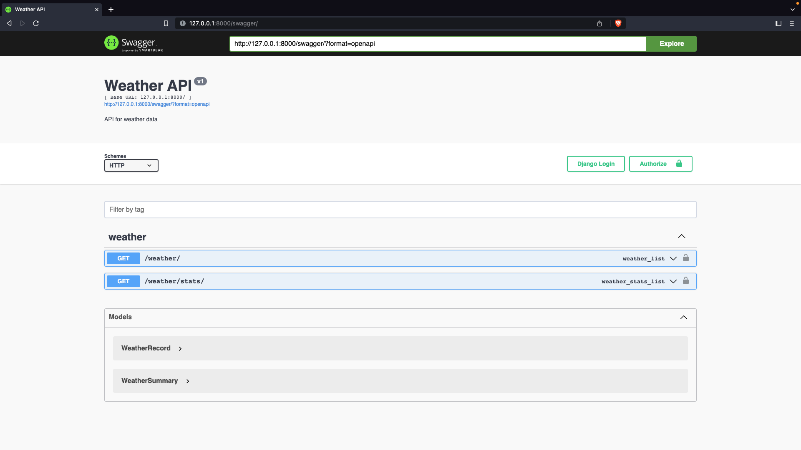
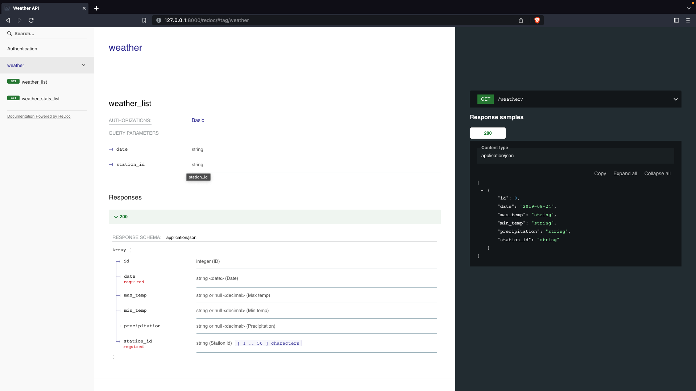

# Weather Data API

An API for accessing weather data records from 1985-01-01 to 2014-12-31 for weather stations in Nebraska, Iowa, Illinois, Indiana, and Ohio.


--- 


## Technologies Used

- Python
- Django
- Django REST Framework
- Swagger/OpenAPI


---


## Installation

1. Clone the repository:

    ```bash
    git clone <repo_url>
    cd <project_name>
    ```

2. Install `pipenv` if not already installed:

    ```bash
    pip install pipenv
    ```

3. Install the required packages and create a virtual environment:

    ```bash
    pipenv install
    pipenv shell
    ```

4. Create migrations for the database tables:

    ```bash
    python manage.py makemigrations
    ```

5. Run the database migrations:

    ```bash
    python manage.py migrate
    ```

6. Ingest and summarize the weather data into the database:

    ```bash
    python manage.py runscript ingest
    python manage.py runscript summarize
    ```

7. Start the development server:

    ```bash
    python manage.py runserver
    ```

8. Navigate to `http://localhost:8000/swagger/` to view the Swagger documentation for the API.


--- 


## API Endpoints

### `/api/weather`

This endpoint returns a paginated list of weather data records. The response includes the following fields:

* `id`: The unique ID of the record
* `station_id`: The ID of the weather station that recorded the data
* `date`: The date of the record in `YYYY-MM-DD` format
* `max_temp`: The maximum temperature for the day in degrees Celsius
* `min_temp`: The minimum temperature for the day in degrees Celsius
* `precipitation`: The amount of precipitation for the day in centimeters

You can filter the response by date and station ID using the `date` and `station_id` query parameters respectively.

Example request:

```
GET /api/weather/?date=20000101&station_id=USC00257715
```

Example response:

```json
{
    "count": 1729957,
    "next": "http://127.0.0.1:8000/weather/?page=2",
    "previous": null,
    "results": [
        {
            "id": 1,
            "date": "1985-01-01",
            "max_temp": "-8.3",
            "min_temp": "-14.4",
            "precipitation": "0.0",
            "station_id": "USC00257715"
        },
        {
            "id": 2,
            "date": "1985-01-02",
            "max_temp": "0.0",
            "min_temp": "-13.3",
            "precipitation": "0.0",
            "station_id": "USC00257715"
        },
        ...
    ]
}
```

### `/api/weather/stats`

This endpoint returns a paginated list of weather data statistics, aggregated by year and station. The response includes the following fields:

* `id`: The unique ID of the record
* `station_id`: The ID of the weather station
* `year`: The year of the statistics
* `avg_max_temp`: The average maximum temperature for the year in degrees Celsius
* `avg_min_temp`: The average minimum temperature for the year in degrees Celsius
* `total_precipitation`: The total accumulated precipitation for the year in centimeters

You can filter the response by station ID using the `station_id` query parameter.

Example request:

```
GET /api/weather/stats/?year=2000&station_id=USC00110072
```

Example response:

```json
{
    "count": 5010,
    "next": "http://127.0.0.1:8000/weather/stats/?page=2",
    "previous": null,
    "results": [
        {
            "id": 1,
            "year": 1985,
            "station_id": "USC00110072",
            "avg_max_temp": "15.3",
            "avg_min_temp": "4.3",
            "total_precipitation": "780.1"
        },
        ...
    ]
}
```


---


## API Documentation

This project provides an API for accessing weather data. The API is documented using the OpenAPI 3.0 specification and can be accessed using Swagger and ReDoc.

To access the Swagger documentation, start the Django development server and navigate to `http://localhost:8000/swagger/`. This will display the Swagger UI, which allows you to interact with the API and view its documentation.

To access the ReDoc documentation, start the Django development server and navigate to `http://localhost:8000/redoc/`. This will display the ReDoc UI, which provides an alternative view of the API documentation.


---


## Testing

This project includes a suite of automated tests to ensure its functionality. To run the tests, activate your virtual environment and use the following command:

```bash
python manage.py test
```

This will run all the tests in the `tests.py` file located in the `app` directory. The tests cover the following areas:

- Ingesting weather data from text files and storing it in the database
- Calculating summary statistics for weather data
- Testing the API endpoints
- Testing pagination


---


## Screen Shots





